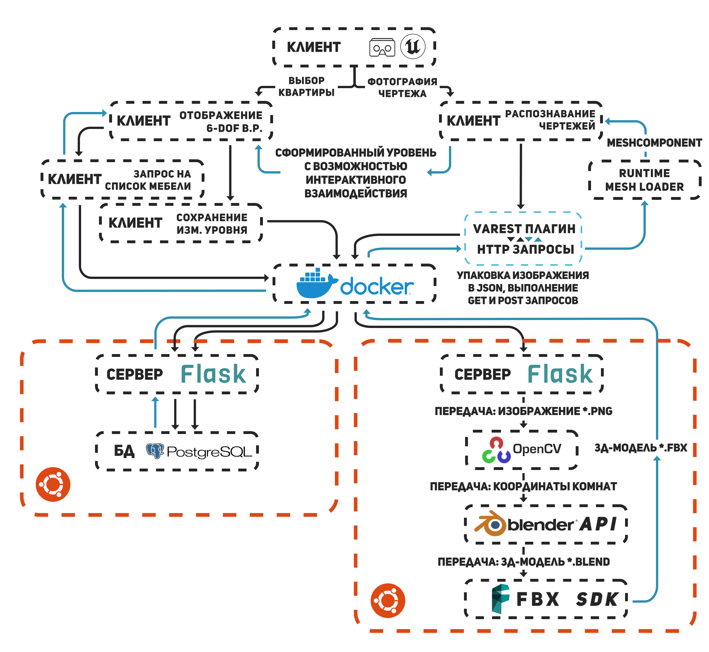

# Project description
Interactive ArchViz with floorplan recognition based on Unreal Engine and OpenCV
# Project architecture

# Demonstration
## Example 1
The first example shows the possibility of moving through pre-prepared apartments, as well as the possibility of tracking a smartphone in space along 6 axes

# Demonstration
## Example 2
The second example shows how a new three-dimensional model of an apartment is created based on a recognized floor plan photo

